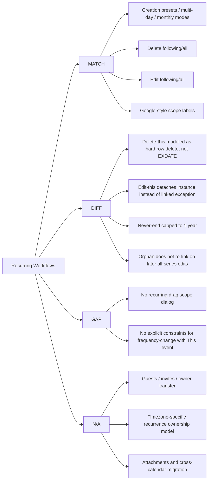

# Recurring Workflow Audit (Plan vs Actual)

Last updated: 2026-03-12

This matrix maps recurring-event workflows to current app behavior and Google-style expectations.

Status legend:
- `MATCH`: Behavior is effectively aligned for this app's scope.
- `DIFF`: Behavior works, but differs from Google-style semantics.
- `GAP`: In scope but missing or incomplete.
- `N/A`: Out of scope for this app.

## Scope and Data Model

- The app stores materialized block instances in SQLite (`blocks` table), with optional `recurrenceId`, `recurrenceIndex`, and serialized `repeatRule`.
- The app does not store RRULE + EXDATE parent-child objects like Google Calendar.
- Core references:
  - `src/types/blocks.ts`
  - `src/storage/blocksDb.ts`
  - `src/utils/recurrence.ts`
  - `src/screens/DayTimeline.tsx`

## Workflow Matrix

| Workflow | Relevant | Current App Behavior | Google-Style Parity | Status | Verification |
| --- | --- | --- | --- | --- | --- |
| Preset repeat (daily/weekly/etc.) | Yes | Supports `daily`, `weekdays`, `weekly`, `monthly`, `yearly` presets in editor. | Same intent. | MATCH | Create block, set each preset, confirm generated instances in future days. |
| Multi-day weekly (Mon/Wed/Fri) | Yes | Weekly supports multiple weekday toggles. | Same intent. | MATCH | Create weekly Mon/Wed/Fri series and verify occurrences for 2-3 weeks. |
| Monthly ordinal (e.g., 3rd Thu / last Mon) | Yes | `monthlyMode` supports ordinal weekday logic. | Same intent. | MATCH | Create monthly ordinal series and verify month transitions. |
| Monthly 31st handling | Yes | Day-of-month mode clamps to month end (31 -> 30/28/29). | Similar outcome (no hidden miss). | MATCH | Create monthly series on Jan 31 and verify Feb/Apr instances. |
| End mode: never / on date / after N | Yes | Supported. `never` capped to 1-year rolling window during build. | Google is effectively unbounded; app is intentionally capped. | DIFF | Create each end mode and validate count/date boundaries. |
| Delete: This event | Yes | Deletes selected row only (hole in materialized chain). | Similar user result, different model (not EXDATE). | DIFF | Delete one occurrence, verify adjacent occurrences remain. |
| Delete: This and following | Yes | Deletes rows with later recurrence index/day. | Similar user result. | MATCH | Delete from mid-series using `This and following`, verify past remains and future removed. |
| Delete: All events | Yes | Deletes all rows in same `recurrenceId` (past + future). | Same user result. | MATCH | Delete with `All events`, verify none remain on any day. |
| Edit: This event (title/time) | Yes | Detaches selected block from series (`recurrenceId` cleared) and saves as one-off. | Google keeps linked exception child; app fully detaches. | DIFF | Edit one occurrence title/time with `This event`, then edit series and check detached instance behavior. |
| Edit: This and following | Yes | Splits chain by assigning new `recurrenceId` for following block set. | Same conceptual split. | MATCH | Edit middle occurrence with `This and following`, verify past unchanged and future updated. |
| Edit: All events | Yes | Updates all rows in recurrence; can rebuild if repeat settings changed. | Similar user result. | MATCH | Edit series with `All events`, verify full-series update including past. |
| Convert one-off to recurring in edit mode | Yes | Supported: changing repeat on non-recurring block creates series from that block. | Useful parity behavior. | MATCH | Edit one-off block, set repeat, save, verify future occurrences created. |
| Scope prompt UX labels | Yes | Single dialog with `This event`, `This and following events`, `All events`. | Google-style wording adopted. | MATCH | Open recurring block edit/delete and confirm single-screen scope options. |
| "Only this event" frequency-change constraints | Yes | Not explicitly constrained. Selecting `This event` while changing repeat semantics can be confusing. | Google typically disallows/parses differently. | GAP | Attempt frequency change with `This event` and validate expected UX/behavior contract. |
| Orphan relinking after single-instance edits | Yes | Detached one-offs are not auto-overwritten by later series edits. | Google usually keeps exception linkage and applies parent field updates. | DIFF | Make single-instance change, then edit all; confirm detached item does not inherit parent changes. |
| Drag recurring instance scope prompt | Yes | Drag updates one row directly; no `This/Following/All` prompt. | Google commonly prompts scope on recurring drag. | GAP | Drag recurring block and verify no scope selector appears. |
| Drag conflict + recurring prompt ordering | Yes | Conflict check exists; no recurring scope prompt in drag path. | Partially aligned only on conflict handling. | GAP | Drag into overlap and confirm snapback/feedback; no scope prompt expected currently. |
| Timezone-traveler exception workflow | No | App uses local day key + minute fields; no event timezone model. | Not comparable. | N/A | N/A for current product scope. |
| DST anchor to creator timezone | No | No creator-timezone recurrence anchor model. | Not comparable. | N/A | N/A for current product scope. |
| Guests, notifications, organizer handover | No | No guests/invite/ownership system. | Not comparable. | N/A | N/A for current product scope. |
| Attachment per-instance vs series | No | No attachment model. | Not comparable. | N/A | N/A for current product scope. |
| Move across calendars/accounts | No | No multi-calendar/account model. | Not comparable. | N/A | N/A for current product scope. |
| Search hydration windows for infinite recurrence | Partial | No dedicated recurrence search engine; month/day views load finite windows. | Different system architecture. | N/A | N/A for current product scope. |

## Visual Status Chart

## High-Value Test Run Order

1. Create weekly Mon/Wed/Fri with `Ends: On date`; verify generated days.
2. Delete one occurrence (`This event`); verify neighboring events remain.
3. Edit series title using `All events`; verify whether deleted-date hole stays absent.
4. Edit one occurrence title/time (`This event`), then edit `All events`; verify detached behavior.
5. Edit one occurrence with `This and following`; verify split chain and independent future edits.
6. Drag a recurring occurrence; verify current no-scope behavior and overlap handling.

## Recommended Next Changes (if aiming for closer Google semantics)

1. Add explicit exception model:
   - Keep recurrence linkage for "This event" edits/deletes via exception records rather than detaching or hard deletes.
2. Add drag scope dialog for recurring blocks:
   - `This event`, `This and following events`, `All events`.
3. Enforce/guide frequency-change scope:
   - Disable or warn on `This event` when frequency or recurrence structure changes.
4. Preserve exception semantics during `All events` edits:
   - Decide policy (`overwrite` vs `preserve`) and implement consistently.
